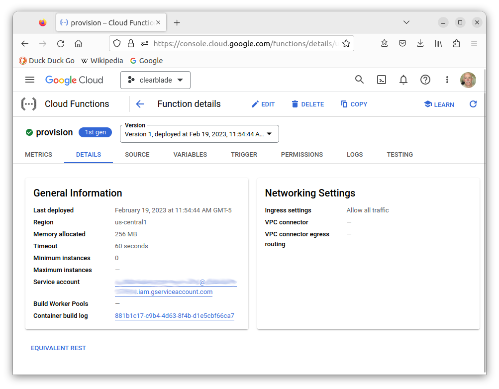

# Google Cloud Function for ClearBlade IoT Device Provisioning

This Cloud Function allows you to provision and synchronize a balena device with ClearBlade IoT Core on Google Cloud in a secure and automated way via an HTTP endpoint. The Cloud Function may be called by a balena device, as seen in the [cloud-relay](https://github.com/balena-io-examples/cloud-relay) example.

| Method | Action |
|-------------|--------|
| POST | Provisions a balena device with IoT Core. First the function verifies the device UUID with balenaCloud. Then it creates a public/private key pair and adds the device to the registry. Finally the function sets balena device environment variables for messaging with IoT Core. |
| DELETE | Removes a balena device from the IoT Core registry and removes the balena device environment variables and public/private key pair. Essentially reverses the actions from provisioning with HTTP POST. |

## Device Environment Variables
Once the Cloud function has provisioned the device with ClearBlade IoT on GCP, it sets balena device environment variables as described below, which allow the device to connect to ClearBlade IoT Core. Some aspects of the variable values are common across devices, and are collected from the Cloud Function deployment.

| Variable | Value |
|----------|-------|
| GCP_CLIENT_PATH | `<registry-path>/devices/<device-id>`<br><br> `<registry-path>` is derived from the project ID, GCP region, and registry ID<br>`<device-id>` is derived from the balena UUID for the device |
| GCP_DATA_TOPIC_ROOT | `/devices/<device-id>` |
| GCP_PROJECT_ID | GCP/ClearBlade project ID |
| GCP_PRIVATE_KEY | Private key in PEM format, base64 encoded to eliminate line wrapping |


## Setup and Testing
### ClearBlade and GCP setup
The Cloud Function interacts with ClearBlade IoT Core on Google Cloud via ClearBlade SDK code operating with GCP and ClearBlade credentials. ClearBlade IoT Core is a separate service built on top of Google Cloud.

First you create a **GCP** project and service account as the foundation for ClearBlade IoT to work with GCP. Then you create a **ClearBlade** IoT Core project, device registry, and service account. These resources are required to register devices and send messages to ClearBlade IoT Core. ClearBlade then forwards device messages on to Google Cloud's Pub/Sub service.

The links below provide instructions to setup these resources.

| Resource | Description |
| ----- | ----------- |
| GCP Project and Service Account | How to create a GCP [project](https://cloud.google.com/resource-manager/docs/creating-managing-projects) and [service account](https://clearblade.atlassian.net/wiki/spaces/IC/pages/2210594981/Creating+Google+Cloud+service+account+key). The result is a JSON file used to create a ClearBlade IoT project.  |
| ClearBlade Account | The ClearBlade [Quick Start](https://clearblade.atlassian.net/wiki/spaces/IC/pages/2209185812/Quick+Start) describes how to activate ClearBlade. |
| ClearBlade Project and Registry | The Quick Start [later](https://clearblade.atlassian.net/wiki/spaces/IC/pages/2209185812/Quick+Start#Create-a-Project) describes how to create a project and registry. Be sure also to select a default telemetry topic from a **GCP** Pub/Sub topic which you must separately create within the GCP project. |
| ClearBlade Service Account | How to create a ClearBlade IoT [service account](https://clearblade.atlassian.net/wiki/spaces/IC/pages/2240675843/Add+service+accounts+to+a+project). You need to provide the generated credentials to the Cloud Function as explained below. |


### Workspace setup
Clone this repo
```
$ git clone https://github.com/balena-io-examples/cb-gcp-iot-provision
```

The sections below show how to test the Cloud Function on a local test server and deploy to Cloud Functions. In either case you must provide the environment variables in the table below as instructed for the test/deployment.

| Key         |    Value    |
|-------------|-------------|
| BALENA_API_KEY | for use of balena API; found in balenaCloud dashboard at: `account -> Preferences -> Access tokens` |
| GCP_PROJECT_ID | GCP/ClearBlade project ID, like `my-project-000000`|
| GCP_REGION | GCP region for registry, like `us-central1` |
| GCP_REGISTRY_ID | Registry ID you provided to create the ClearBlade IoT registry |
| CB_SERVICE_ACCOUNT |base64 encoding of the JSON formatted ClearBlade service account credentials provided by ClearBlade. The credentials are generated when you create the service account as described in the setup instructions above. Example below.<br><br>`cat <credentials.json> \| base64 -w 0` |

### HTTP API
The HTTP endpoint expects a request containing a JSON body with the attributes below. Use POST to add a device to the cloud registry, DELETE to remove.

| Attribute | Value |
|-----------|-------|
| uuid | UUID of device  |
| balena_service | (optional) Name of service container on balena device that uses provisioned key and certificate, for example `cloud-relay`. If defined, creates service level variables; otherwise creates device level variables. Service level variables are more secure. |


### Test locally
The Google Functions Framework is a convenient tool for local testing. 
First, start a local HTTP server ([docs reference](https://cloud.google.com/functions/docs/running/function-frameworks)) using a script like below in the directory containing the clone of the `cb-gcp-iot-provision` project.

```
export BALENA_API_KEY=<...>
... <other environment variables from table above>
export CB_SERVICE_ACCOUNT=<...>

npx @google-cloud/functions-framework --target=provision
```

Next, use `curl` to send an HTTP request to the local server to provision a device. See the *HTTP API* section above for body contents.

```
curl -X POST http://localhost:8080 -H "Content-Type:application/json" \
   -d '{ "uuid": "<device-uuid>", "balena_service": "<service-name>" }'
```

After a successful POST, you should see the device appear in your IoT Core registry and `GCP_CLIENT_PATH`, `GCP_DATA_TOPIC_ROOT`, `GCP_PRIVATE_KEY`, and `GCP_PROJECT_ID` variables appear in balenaCloud for the device. After a successful DELETE, those variables disappear.

## Deploy
To deploy to Cloud Functions, use the command below. See the [command documentation](https://cloud.google.com/sdk/gcloud/reference/functions/deploy) for the format of `yaml-file`, which contains the variables from the table in the *Workspace setup* section above.

```
gcloud functions deploy provision --runtime=nodejs16 --trigger-http \
   --env-vars-file=<yaml-file> --allow-unauthenticated \
   --service-account=<name>@<xxxx>.iam.gserviceaccount.com
```

The result is a Cloud Function like below. Notice the `TRIGGER` tab, which provides the URL for the function.



### Test the Cloud Function
To test the function, use a command like below, where the URL is from the `TRIGGER` tab in the console. See the *HTTP API* section above for body contents.

```
curl -X POST https://<region>-<projectID>.cloudfunctions.net/provision \
   -H "Content-Type:application/json" \
   -d '{ "uuid": "<device-uuid>", "balena_service": "<service-name>" }'
```

After a successful POST, you should see the device appear in your IoT Core registry and `GCP_CLIENT_PATH`, `GCP_DATA_TOPIC_ROOT`, `GCP_PRIVATE_KEY`, and `GCP_PROJECT_ID` variables appear in balenaCloud for the device. After a successful DELETE, those variables disappear.
